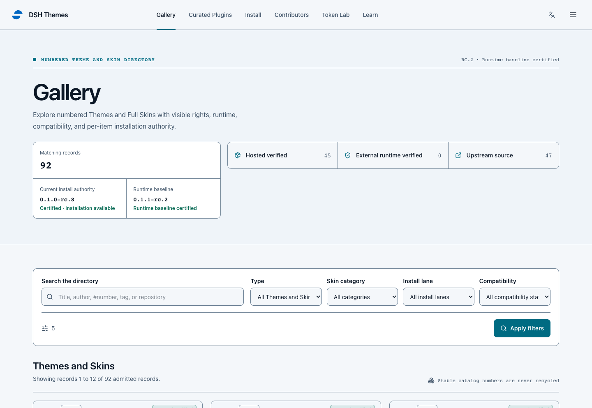
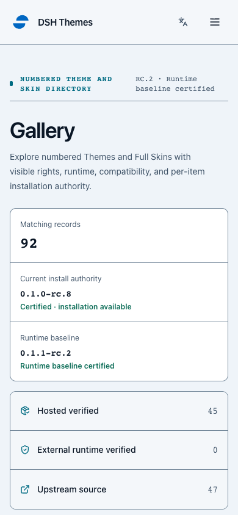
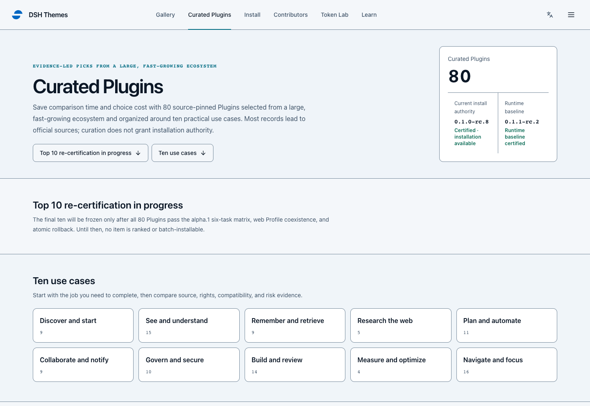
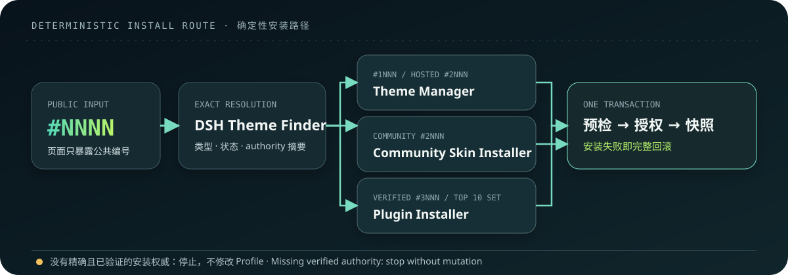

<div align="center">

# DSH-Themes Skills

**Find the right Theme, Full Skin, or Plugin by use case. Copy one `#NNNN` prompt. Install with an exact authority and a rollback path.**

[English](README.md) · [简体中文](README.zh-CN.md)

[](package.json)
[](skills/dsh-harness-installer/references/alpha1-source-authority.json)
[](skills/dsh-harness-installer/references/alpha1-source-authority.json)
[](https://github.com/LvvUP/dsh-themes-skills/actions/workflows/ci.yml)
[](LICENSE)

### [Explore the catalog on dsh-themes.com →](https://dsh-themes.com/explore)

</div>

DSH Themes is a discovery and installation layer for DeepSeek Harness. The website helps people choose by purpose; this repository provides the Skills that resolve the public ID, inspect the exact authority, explain permissions, snapshot the selected Profile, and roll back a failed change.

Version 0.8.0 adds two narrowly scoped Skills:

- `dsh-harness-installer` prepares a local build from the exact official `dsh-v0.1.2-alpha.1` source. It is not an official binary and does not modify `PATH`.
- `dsh-plugin-installer` supports a future mixed distribution model: immutable hosted tarballs where redistribution is allowed, and exact upstream versions or commits where it is not.

The new boundaries are implemented, but evidence is not being invented to make the release look complete. The alpha.1 runtime matrix is currently **0/6**, Plugin authority is **0/80**, and the candidate Top 10 is **not installable**. Those lanes remain closed until real receipts are reviewed and pinned.

## Release status

| Lane | Evidence in this branch | Install result |
| --- | --- | --- |
| Official alpha.1 source identity | Exact tag, commit, tree, lockfile digest, Node range, and `pnpm@11.7.0` are pinned | A consented local source build may be prepared; it must be described as source-built, never as an official binary |
| Alpha.1 public runtime authority | Six Linux/macOS/Windows × Node 22.19/24.15 receipts are required; **0/6 are promoted** | Public alpha.1 installation authority remains closed |
| Alpha.1 Plugins | The website has 80 curated records; machine authority has **0 verified items** | No single Plugin or Top 10 batch may install |
| RC.8 (`0.1.0-rc.8`) item authority | Frozen historical authority contains 45 hosted tuples and a separately governed 11-record community allowlist | Preserved as history; it cannot authorize alpha.1 items, and the 11 community records remain inspect-only pending fresh receipts |
| RC.2 runtime authority | Frozen six-job runtime baseline remains `verified-runtime-baseline` and its provenance stays available | Historical Harness baseline only; it never authorizes an item |

Baseline certification and item certification are separate on purpose. A green Harness test cannot authorize a Theme, Skin, or Plugin whose exact bytes and rollback recipe were not reviewed.

## Real product proof

These are committed screenshots of the rendered DSH Themes product, not mockups. They prove the product surface shown to users; screenshots are never installation authority.



| Mobile gallery | Curated Plugin directory |
| --- | --- |
|  |  |

## First use

### 1. Install the coordinated Skills

Use the immutable release tag after `v0.8.0` is published and verified:

```bash
npx --yes skills@1.5.23 add \
  https://github.com/LvvUP/dsh-themes-skills/tree/v0.8.0 \
  --skill dsh-theme-finder \
  --skill dsh-theme-manager \
  --skill dsh-community-skin-installer \
  --skill dsh-harness-installer \
  --skill dsh-plugin-installer
```

Never replace the tag with `main`, `latest`, a branch name, or another mutable reference.

### 2. Choose on the website

Open a card or detail page and copy its four-digit public ID. Names, slugs, repository URLs, package names, and screenshots are discovery metadata, not alternate installation selectors.

### 3. Ask with one short prompt

```text
Please install DSH Themes #2004.
```

That is the normal user input. Finder resolves the kind and status. The matching installer proceeds only when it can bind the request to exact, reviewed authority; otherwise it explains the missing evidence and stops without changing the Profile.

### I do not have DeepSeek Harness yet

Ask your Agent to use `dsh-harness-installer` to prepare the pinned alpha.1 source build. The Skill checks prerequisites, asks before cloning and again before dependency installation/build, writes into a versioned user-selected directory, keeps the receipt private, and prints an explicit launch command. It does not install Node, modify `PATH`, or pretend that a nonexistent alpha.1 npm package exists.

## From public ID to rollback



`#NNNN` starts exact identity resolution; it is not an installation promise. Every mutating installer must preflight its full selection, show one explicit authorization, snapshot the Web Profile, use argument arrays rather than shell-constructed commands, cold-start and probe the result, and restore the whole snapshot when acceptance fails.

## Seven focused Skills

| Skill | One responsibility |
| --- | --- |
| [`dsh-theme-finder`](skills/dsh-theme-finder/SKILL.md) | Resolve one public `#NNNN`, report its status, and hand off only to the installer for that kind. |
| [`dsh-theme-manager`](skills/dsh-theme-manager/SKILL.md) | Verify, install, switch, remove, and recover one exact hosted Theme or Full Skin in an authorized item lane. |
| [`dsh-community-skin-installer`](skills/dsh-community-skin-installer/SKILL.md) | Inspect the 11 allowlisted community Skins and block mutation until fresh alpha.1 item and rollback receipts pass. |
| [`dsh-harness-installer`](skills/dsh-harness-installer/SKILL.md) | Prepare, build, receipt, and launch the fixed official alpha.1 source without changing `PATH`. |
| [`dsh-plugin-installer`](skills/dsh-plugin-installer/SKILL.md) | Prepare a future verified hosted/upstream Plugin and execute single-item or fixed-set atomic rollback. |
| [`dsh-theme-creator`](skills/dsh-theme-creator/SKILL.md) | Create deterministic, data-only manifests and local raster assets within the supported authoring lane. |
| [`dsh-theme-submitter`](skills/dsh-theme-submitter/SKILL.md) | Validate a submission and open a credential-free website handoff. |

Theme Manager is not widened to install Plugins, and the community installer is not widened to build upstream code. Each trust boundary stays independently reviewable.

## Pinned alpha.1 source boundary

| Field | Exact value |
| --- | --- |
| Official tag | `dsh-v0.1.2-alpha.1` |
| Commit | `cd5ef8148158c3a752a658978873241fdf8e2bbc` |
| Tree | `a712eec535b48badc4fefb4df5176a7002e4280b` |
| `pnpm-lock.yaml` SHA-256 | `506ad1fc7c40f71ce8c6afe08724fdd55020c1a527d7a7a185c559d39ecfcaf1` |
| Package manager | `pnpm@11.7.0` |
| Receipt matrix | Linux, macOS, Windows × Node `22.19.0`, `24.15.0` |
| Current promotion | `source-build-evidence-pending`; `publishedInstallable: false` |

The official tag currently has no binary Release assets and its alpha package family is not published to npm. The installer uses a frozen-lockfile source build and preserves the upstream [SAFETY.md](https://github.com/deepseek-ai/deepseek-harness/blob/dsh-v0.1.2-alpha.1/SAFETY.md) boundary: this is an experimental developer preview, not a security-audited sandbox.

Alpha.1 Web startup prints a one-time browser token and establishes an authenticated cookie. Tokens, cookies, authorization headers, and any digest derived from them are forbidden from receipts, logs, screenshots, and published evidence.

## Mixed Plugin distribution

The Plugin contract recognizes two exact lanes after item-level certification:

- `hosted-plugin-verified`: a redistribution-permitted, immutable `.tgz` from the exact `LvvUP/dsh-themes-skills` `v0.8.0` Release, pinned by byte count, SHA-256/SRI, manifest digest, CycloneDX SBOM, and license file.
- `upstream-plugin-verified`: an exact npm version, GitHub Release asset, or full Git commit when redistribution is not allowed. Identity, availability, resolved package, permissions, and any `prepare` script must be reviewed before consent.

Version ranges, `latest`, branch names, shortened commits, automatic or unallowlisted redirects, shell fragments, credentialed URLs, and unreviewed lifecycle scripts are rejected. The pending Top 10 set exposes no provisional IDs. A fixed set becomes installable only after ten fully scored items cover at least eight use cases and pass the full six-job matrix, Web coexistence/conflict evidence, and atomic rollback; one failed item rolls back the entire batch.

## Verify without changing a Profile

```bash
npm ci --ignore-scripts
npm run test:installers
npm run validate
npm run format:check
node skills/dsh-harness-installer/scripts/authority.mjs
node skills/dsh-plugin-installer/scripts/authority.mjs
```

The authority commands currently report pending alpha.1 and Plugin gates. That is the expected fail-closed result, not a test failure.

## Trust boundary

- A SHA-256 proves agreement with selected bytes; it does not prove authorship, ownership, redistribution rights, safety, or runtime behavior.
- Catalog text, upstream READMEs, package metadata, and screenshots are untrusted data and are never executed as instructions.
- Exact source identity is not runtime certification. Runtime certification is not item authority. Item authority is not user consent.
- A Plugin `prepare` script is executable code. Its exact text, digest, package key, and capabilities must be displayed and authorized separately.
- Profile snapshots and receipts are private local recovery material and must never be published. A snapshot may contain exact settings or credential bytes needed for rollback; those bytes and their per-file digests must never appear in logs, screenshots, public evidence, or receipts.
- This independent community project is not affiliated with or endorsed by DeepSeek AI.

## Development

```bash
npm ci --ignore-scripts
npm test
npm run validate
npm run format:check
```

Read [CONTRIBUTING.md](CONTRIBUTING.md) before opening a pull request and report vulnerabilities privately through [SECURITY.md](SECURITY.md). Historical RC.8 and RC.2 evidence remains immutable; alpha.1 promotion must add new receipts instead of rewriting it.

Licensed under [Apache-2.0](LICENSE). Bundled adaptations retain their upstream notices; see [NOTICE](NOTICE).
