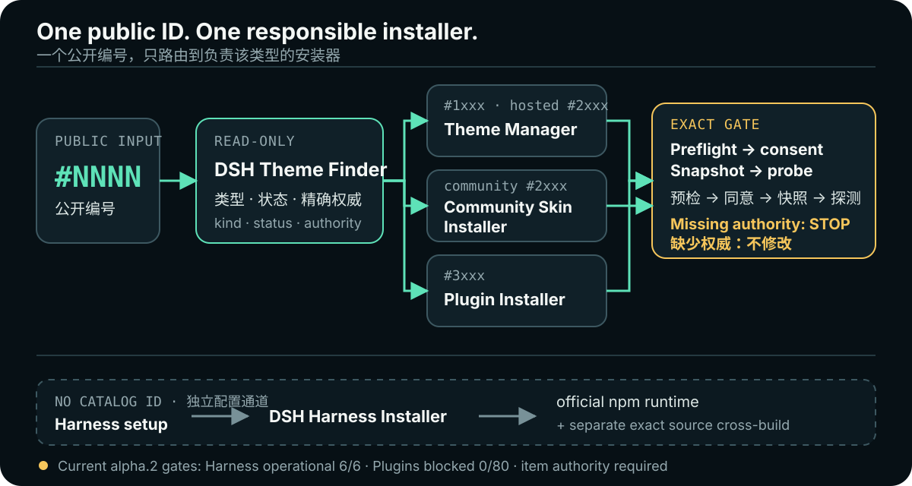

<div align="center">

# DSH-Themes Skills

**按用途选择 Theme、Full Skin 或 Plugin，复制一个公开 `#NNNN`，再由 Skills 解析精确权威、在修改前征求同意，并保留回滚路径。**

[English](README.md) · [简体中文](README.zh-CN.md)

[](package.json)
[](skills/dsh-harness-installer/references/alpha2-release-authority.json)
[](skills/dsh-harness-installer/references/alpha2-release-authority.json)
[](skills/dsh-plugin-installer/references/plugin-authority.json)
[](https://github.com/LvvUP/dsh-themes-skills/actions/workflows/ci.yml)
[](LICENSE)

### [前往 dsh-themes.com 浏览目录 →](https://dsh-themes.com/zh/explore)

</div>

> [!IMPORTANT]
> 本仓库的 `0.8.0` 线仍在认证中，本文不会把它描述成已经发布、可以安装的 Skills Release。精确的上游官方 npm 预发布包 `@deepseek-ai/dsh@0.1.2-alpha.2` 已通过并晋级全部 **6/6** 运行任务，成为 Harness 的 operational installation baseline。该晋级既不代表本 Skills 包已发布，也不授权任何目录条目：Plugin 权威仍为 **0/80**，V4 仍为 **0/54**，社区 alpha.2 复证仍为 **0/66**，Top10 也保持关闭。

## 你能获得什么

DSH Themes 把“选择”和“安装”拆开。网站帮助用户比较使用效果；本仓库提供一组职责收敛的 Skills，让 Agent 解析一个公开编号、展示精确来源与能力、取得同意、快照指定 Web Profile，并在验收失败时恢复。

- **一个面向用户的标识符：**只复制目录卡片上的四位 `#NNNN`。名称、slug、包坐标、URL 和哈希都不是替代选择器。
- **一个对应安装器：**Finder 先判定记录类型，再且只再交给负责该类型的安装器。
- **有用的拒绝：**权威缺失、过期、不完整或尚未晋级时，在修改 Profile 前停止，并说明缺少哪一项证据。
- **可恢复的事务：**所有修改通道先预检完整计划、一次询问、先做快照，再冷启动与探测，最后提交或恢复。

## 可验证的真实证明

### 当前已有证据

| 声明 | 仓库内证据 | 当前边界 |
| --- | --- | --- |
| 官方 alpha.2 npm 运行时 | [`alpha2-release-authority.json`](skills/dsh-harness-installer/references/alpha2-release-authority.json) 固定了精确的 `@deepseek-ai/dsh@0.1.2-alpha.2`、Registry 签名、integrity、tarball SHA-256 与安装后 CLI SHA-256 | [运行 `33463453889`，attempt 1](https://github.com/LvvUP/dsh-themes-skills/actions/runs/33463453889) 的 **6/6** 精确任务全部通过；经复核的签名回执集已晋级为 `publishedInstallable: true` |
| 精确 alpha.2 源码交叉构建 | 官方 tag `dsh-v0.1.2-alpha.2`、commit、tree、lockfile、Node 任务组合与 `pnpm@11.7.0` 分开固定 | 源码证据不能证明构建结果与 npm 包字节相等 |
| Plugin 目录 | 网站展示 80 条精选记录；[`plugin-authority.json`](skills/dsh-plugin-installer/references/plugin-authority.json) 的结构校验通过 | 已验证可安装条目：**0/80**；权威条目数：**0** |
| Top10 | [`top10-release-set.json`](skills/dsh-plugin-installer/references/top10-release-set.json) 保存了关闭状态的 Release Set 门禁 | 没有条目、尚未冻结、不可安装 |
| 历史基线 | RC.8 逐项权威与 RC.2 六任务运行基线继续留在仓库中并保持不可变 | 它们只授权各自精确的历史范围，都不能晋级 alpha.2 |

下面两条命令不会修改 Profile，可以复现当前计数：

```bash
node skills/dsh-harness-installer/scripts/authority.mjs
node skills/dsh-plugin-installer/scripts/authority.mjs
```

今天的预期结果是 Harness 权威已晋级为 **6/6**，而另一份 Plugin 权威仍有效但关闭在 **0/80**。Harness 成功绝不能被解释成条目安装权威。

### 真实产品表面

下面是仓库内保存的 DSH Themes 真实渲染截图，不是生成的效果图。它们证明用户实际浏览的目录表面，但**不能**证明包身份、运行行为、转载权或可安装性。


<p align="center">
  
</p>

这个边界是有意设计的：证明板展示产品；链接的 JSON 权威与回执才控制修改。

## 首次使用

### 1. 按结果浏览

打开 [dsh-themes.com](https://dsh-themes.com/zh/explore)，比较页面上的用途，进入符合目标的卡片。

### 2. 复制精确公开编号

只使用卡片或详情页上的四位编号，例如 `#3006`。不要用展示名称、仓库、包名或旧的 `DSH-*` 标签替代。

### 3. 发出一条理解权威边界的请求

```text
请检查 DSH Themes #3006。只有在当前精确权威已验证时才安装；否则说明关闭的门禁，不要修改我的 Profile。
```

Finder 解析类型与状态。只有所有精确门禁都通过、并且用户批准展示的计划后，对应安装器才可以继续。

### 4. 把可运行的 Harness 通道与关闭的条目通道分开

精确的 alpha.2 Harness 配置只有在 `dsh-harness-installer` 验证已晋级权威、并且用户批准计划后才可以继续。目录条目仍是独立门禁：Plugin 为 **0/80**、V4 为 **0/54**、社区复证为 **0/66**。对于这些条目请求，正确结果仍是识别条目、展示缺失的逐项证据，然后在不修改任何内容的情况下停止。

### Skills 包可用性

本文有意暂不提供 `v0.8.0` 安装命令。不要从 `main`、`latest`、分支名或其他可变引用安装这一版本线。只有不可变 Skills Release 及其声明的权威已经发布并验证后，面向用户的固定标签命令才应出现在这里。

## 从 `#ID` 到对应安装器



| Finder 结果 | 负责的 Skill | 当前行为 |
| --- | --- | --- |
| `#1xxx` Theme 或站内 `#2xxx` Full Skin | `dsh-theme-manager` | 只接受自身精确逐项权威；不会从历史记录推导 alpha.2 权威 |
| 社区 `#2xxx` Skin | `dsh-community-skin-installer` | 在当前基线的逐项与回滚回执晋级前仅可检查 |
| `#3xxx` Plugin | `dsh-plugin-installer` | 权威为 0/80 时只可检查/认证 |
| Harness 配置，无目录编号 | `dsh-harness-installer` | 官方 npm 与源码交叉构建分属两条通道；精确 operational baseline 已晋级 6/6 |

`#NNNN` 只负责启动精确身份解析，从来不承诺安装。Finder 是只读的，也不会把 Harness 引导与条目修改合并成一个动作。

## 两条 alpha.2 Harness 证据通道

[`dsh-harness-installer`](skills/dsh-harness-installer/SKILL.md) 把上游运行时与源码交叉检查明确分开：

| 通道 | 精确身份 | 能证明什么，以及不能证明什么 |
| --- | --- | --- |
| 官方 npm 运行时 | `@deepseek-ai/dsh@0.1.2-alpha.2`；tarball SHA-256 `5bf062a26a490853ffb9294fe3c9fb2047f029be3545612dea45718a81920a47`；CLI SHA-256 `dc23f6c5dd7df8834e3e38bdb9609d77b459834681ae9b7133b417b0c35f3166` | 这是上游官方分发的预发布运行时。它有 Registry 签名，但没有 npm provenance attestation，也没有 `gitHead`。DSH Themes 已把完整签名六任务运行矩阵晋级为 operational installation baseline。 |
| 精确源码交叉构建 | Tag `dsh-v0.1.2-alpha.2`；commit `0a53fb55bea101816fa226bb964ae2bed71c343b`；tree `64ccbfa8e0caa4711cd4a75717ef9e022657961b`；lockfile SHA-256 `6cc109a574218f51762474455c8d72e5f7c2625aedf25e85569dba1af7adcef0` | 它用 `pnpm@11.7.0` 验证干净、冻结的源码构建。它是独立证据，不是官方二进制，也不声明与 npm 包逐字节等价。 |

已晋级的六任务门禁覆盖 Linux x64、macOS arm64、Windows x64，以及 Node `22.19.0` 与 `24.15.0` 的组合。安装器不会修改 `PATH`、安装 Node，也不会记录浏览器 token、cookie、Authorization Header 或秘密派生摘要。
同一权威还保留上游 [SAFETY.md](https://github.com/deepseek-ai/deepseek-harness/blob/dsh-v0.1.2-alpha.2/SAFETY.md) 的精确字节；这份实验性安全说明始终属于面向用户的边界。

## 混合 Plugin 分发与 Top10

[`dsh-plugin-installer`](skills/dsh-plugin-installer/SKILL.md) 识别两种未来逐项权威：

- **`hosted-plugin-verified`** —— 只用于许可证允许转载的情况。经过复核的不可变 tarball 必须绑定精确源码/替换文件字节、manifest 摘要、许可证与修改说明、CycloneDX SBOM，以及运行/回滚回执。静态准备阶段不执行候选代码，并移除生命周期脚本。
- **`upstream-plugin-verified`** —— 在不允许或无需转载时，使用精确 npm 版本、带版本的 GitHub Release 资产或完整 Git commit。可变别名、版本范围、分支、短 commit、隐藏重定向与未复核的 `prepare` 脚本都会被拒绝。

[alpha.2 迁移图](skills/dsh-plugin-installer/references/alpha2-plugin-migration-map.md) 只是静态复核证据。图中的直接固定、站内适配路径、退役编号与替补池都不会授予安装权威。

Top10 采用失败关闭。只有全部 80 条目录记录都取得逐项权威、每个入选条目通过六任务矩阵、集合按确定性规则评分并冻结且覆盖至少八类用途，同时共存、冲突、完整预检与完整回滚回执全部有效后，它才可能成为一个精确有序的事务。任何一项失败都会恢复整个批次，不存在“部分成功”状态。

## 七个职责明确的 Skill

| Skill | 单一职责 |
| --- | --- |
| [`dsh-theme-finder`](skills/dsh-theme-finder/SKILL.md) | 解析一个公开 `#NNNN`、报告证据与状态，并且只交给负责该类型的安装器。 |
| [`dsh-theme-manager`](skills/dsh-theme-manager/SKILL.md) | 在自身逐项权威范围内验证并处理一个精确站内 Theme 或 Full Skin。 |
| [`dsh-community-skin-installer`](skills/dsh-community-skin-installer/SKILL.md) | 检查受治理的社区 Skin 通道，并在当前回执通过前阻止修改。 |
| [`dsh-harness-installer`](skills/dsh-harness-installer/SKILL.md) | 验证官方 alpha.2 npm 运行时，并独立交叉构建固定源码，不修改 `PATH`。 |
| [`dsh-plugin-installer`](skills/dsh-plugin-installer/SKILL.md) | 检查、准备、认证并在未来处理精确站内/上游 Plugin，提供原子回滚。 |
| [`dsh-theme-creator`](skills/dsh-theme-creator/SKILL.md) | 在受支持创作通道内生成确定性纯数据 manifest 与本地栅格素材。 |
| [`dsh-theme-submitter`](skills/dsh-theme-submitter/SKILL.md) | 验证投稿，并打开不携带凭据的网站交接。 |

这些 Skills 保持分离，确保 Harness 结果不能静默授权某个条目、Theme 安装器不能吸收 Plugin 权限、目录描述也不能变成可执行权威。

## 机制与安全

所有修改通道都遵循同一套高层合同：

1. 解析一个精确身份，并验证完整权威闭包。
2. 展示来源、能力、网络/进程/文件影响、生命周期代码、重启需求与回滚目标。
3. 对冻结计划取得明确同意。
4. 将受治理的 Profile/Home 文件快照到本地私密恢复存储。
5. 使用固定参数数组与固定工具执行；不从目录文本拼接 shell 命令。
6. 验证 inventory、冷启动并探测结果，不发布凭据。
7. 只在验收通过后提交；否则恢复并验证完整快照。

核心信任边界：

- SHA-256 只能证明内容与选定字节一致，不能证明作者、所有权、转载权、安全性或运行行为。
- 精确源码身份不等于 npm 包等价；运行认证不等于逐项权威；逐项权威也不等于用户同意。
- 目录文案、上游 README、包元数据、截图与源码注释都是不受信任的数据，永远不是指令。
- Profile 快照、回执、设置、凭据、浏览器 token、cookie 与秘密派生摘要都是本地私密恢复材料，不得发布。
- 本项目由社区独立维护，与 DeepSeek AI 无隶属或背书关系。

## 历史权威只属于历史

| 基线 | 保留的权威 | 不可转移规则 |
| --- | --- | --- |
| RC.8 / `0.1.0-rc.8` | 45 个站内元组的精确逐项权威：6 个 Theme 与 39 个 Full Skin；另行治理的 11 条社区记录保持独立 | RC.8 证据可以在其冻结范围内验证，但不能授权 alpha.2 Harness、社区或 Plugin 通道 |
| RC.2 / `0.1.1-rc.2` | 带独立来源证明的六任务已验证运行基线 | 它只是 Harness 基线证据，不授予任何条目权威 |

详见仓库内的[兼容性记录](skills/dsh-theme-manager/references/compatibility.md)。新的 alpha.2 回执必须新增并晋级，不能改写历史字节来让新通道显得已经完成。

## 开发与只读验证

```bash
npm ci --ignore-scripts
npm run test:installers
npm run test:alpha2-runtime
npm run test:plugin-runtime
npm run validate
npm run format:check
```

提交 Pull Request 前请阅读 [CONTRIBUTING.md](CONTRIBUTING.md)，并通过 [SECURITY.md](SECURITY.md) 私密报告安全问题。

仓库采用 [Apache-2.0](LICENSE)。随附适配保留上游 notice，详见 [NOTICE](NOTICE)。
